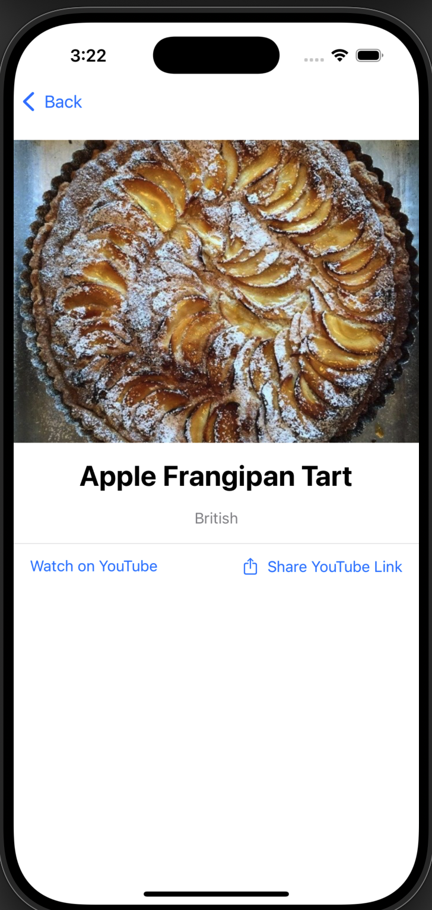

//
//  README.md
//  FetchTakeHomeProject
//
//  Created by Tyson Lefever on 2/4/25.
//

### Summary: Include screen shots or a video of your app highlighting its features

I've provided some images in the Assets folder. Even though the project description said the app should be one screen, I thought I could make the UI/UX better by having a second screen to display the bigger image and the links. From the images, you can see the recipes are listed and a search bar allows the user to refine the results by name or cuisine. Each recipe has a navigation link to a detail view, where the links are provided and an option to share is available. The main view is refreshable via pulldown with the .refreshable{} modifier.

### Focus Areas: What specific areas of the project did you prioritize? Why did you choose to focus on these areas?

My main focus was the UI/UX. The API functionality is very straightforward, so I spent my time making the app very useful to a user. Having a detail view to hone in on a recipe I believe is a natural instinct that a user has when using an app like this.

### Time Spent: Approximately how long did you spend working on this project? How did you allocate your time?

I spent roughly 2 hours on this. Building out the Model and the ViewModel took up about 45 minutes, I had to refresh some of my knowledge with native SwiftUI API calls, since I'm used to employing third party libraries for these tasks, namely AlamoFire and SwiftyJSON. The remainder of the time spent was building out a clean and user friendly UI.

### Trade-offs and Decisions: Did you make any significant trade-offs in your approach?
    I had to make some decisions about how to use the attributes of Recipe, since I wanted almost a Craigslist-esque UX, where you can preview an item before clicking on it for more details.

### Weakest Part of the Project: What do you think is the weakest part of your project?
There are two parts of the project I couldn't get to, primarily for time's sake. I didn't implement any image caching, and didn't include any tests. Because the project only sends the one API request and the response is relatively small, image caching wasn't necessary to ensure network efficiency. As for testing, I couldn't get around to it with the time I have to spare. I'd love to go over both of these things in a follow up interview, given the chance.

### Additional Information: Is there anything else we should know? Feel free to share any insights or constraints you encountered.
  What I just briefly mentioned, not having enough free time to put more into this, was hopefully not too big of a deterrant from discussing the iOS Engineering role further. I have an app on the appstore with a similar UI, Nofie, which employs a lot of network efficiency tools, and has test coverage. Would love to have the reviewers check it out as a further display of my iOS abilities!
